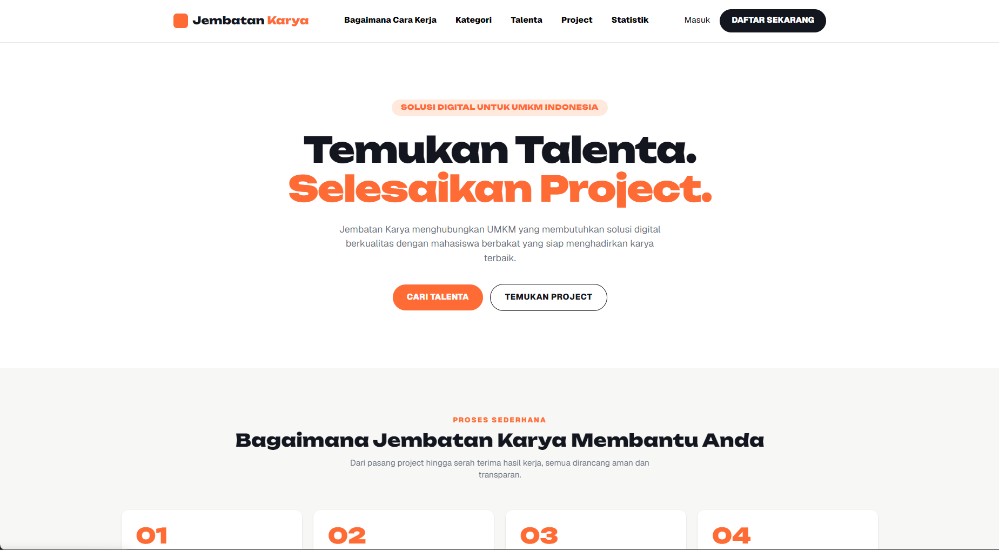
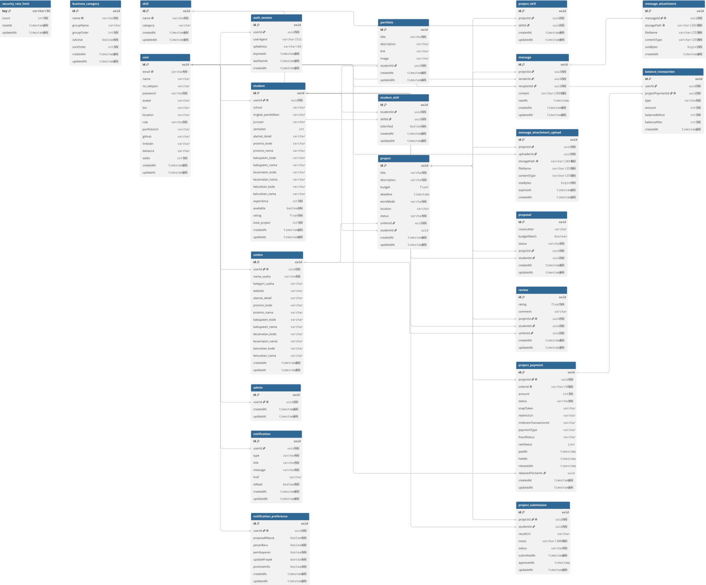

<div align="center">
  
  # Jembara
  ### Jembatani skillmu untuk kesempatan nyata
  
  [](https://jembara.web.id)
  [](https://github.com/Reno11052009/jembara)
  [](LICENSE)
  
  **Submission for ITECHNO CUP 2026 - Web Development**
  
  **By Terserah**
  
</div>

---

## 📋 Daftar Isi

- [Tentang Proyek](#-tentang-proyek)
- [Fitur Unggulan](#-fitur-unggulan)
- [Demo & Screenshot](#-demo--screenshot)
- [Teknologi](#-teknologi)
- [Arsitektur Sistem](#-arsitektur-sistem)
- [Instalasi & Setup](#-instalasi--setup)
- [Penggunaan](#-penggunaan)
- [API Documentation](#-api-documentation)
- [Testing](#-testing)
- [Tim Developer](#-tim-pengembang)
- [Lisensi](#-lisensi)

---

## 👥 Tim Developer

| Nama | Peran | GitHub |
|------|-------|--------|
| **Chello Arta Sukma Hadinata** | Project Lead & UI/UX Designer | [GitHub](https://github.com/SauraAsh) |
| **Dico Zakaria Putra Aydia Subagio** | Frontend Developer | [GitHub](https://github.com/Ozakae) |
| **Arsya Mayreno Arnaldo** | Backend Developer | [GitHub](https://github.com/Reno11052009) |

---

## 🎯 Tentang Proyek

### Latar Belakang

Pengangguran masih menjadi masalah besar di Indonesia,terutama di kalangan pelajar/mahasiswa dan orang-orang yang baru lulus sekolah. Hal ini disebabkan oleh beberapa faktor, antara lain: Kurangnya kesempatan kerja, Kurangnya skill yang dimiliki, Kurangnya pengalaman kerja, Kurangnya informasi mengenai lowongan kerja, Kurangnya akses untuk mendapatkan pekerjaan, Kurangnya akses untuk mendapatkan pelatihan

### Solusi yang Ditawarkan

Dengan website Jembara ini kita dapat mengurangi jumlah pengangguran di Indonesia dengan cara memudahkan mereka untuk mencari pekerjaan yang sesuai dengan apa yang mereka inginkan.

### Tujuan Proyek

- 🎯 **Tujuan Utama**: Membantu pelajar/mahasiswa/orang-orang untuk mendapatkan pekerjaan
- 📊 **Target Pengguna**: Mahasiswa, Pengangguran, Freelancer, Pekerja part-time
- 💡 **Value Proposition**: Website pencari pekerjaan dengan sistem matchmaking dan fokus pada usaha UMKM

---

## ✨ Fitur Unggulan

### Fitur Utama

| Fitur | Deskripsi | Keunggulan |
|----------|--------------|---------------|
| **Smart Matching** | Menghitung kecocokan skill Student dengan kebutuhan setiap project dan mengurutkan rekomendasi project maupun kandidat. | Membantu Student menemukan peluang yang relevan dan UMKM menyeleksi talent secara lebih terarah. |
| **Kolaborasi End-to-End** | Mendukung pemilihan kandidat, pembayaran melalui Midtrans, pesan dan lampiran, pengiriman hasil, review pekerjaan, hingga penyelesaian project. | Seluruh perjalanan project tercatat dan dikelola dalam alur kerja yang jelas dari `OPEN` sampai `COMPLETED`. |
| **Jelita AI Assistant** | Membantu Student dan UMKM memahami fitur platform serta memberikan rekomendasi project atau talent berdasarkan data Jembara. | Memudahkan pengguna mendapatkan panduan serta rekomendasi proyek dan talenta secara cerdas. |
| **Portfolio & Skill Passport** | Menampilkan karya, skill, status verifikasi, project selesai, rating, dan testimoni Student berdasarkan data platform. | Membantu Student membangun rekam jejak serta reputasi profesional dari pengalaman project nyata. |

### Fitur Tambahan

- **Pesan & Lampiran Project** - Memfasilitasi komunikasi antara UMKM dan Student terpilih, termasuk pengiriman lampiran melalui penyimpanan privat.
- **Dashboard Berbasis Peran** - Menyediakan ringkasan dan menu yang disesuaikan untuk Student, UMKM, dan Admin berdasarkan data platform.

---

## 📸 Demo & Screenshot

### Live Demo

🔗 **[Kunjungi Website](https://jembara.web.id)**

### Screenshot Aplikasi

<div align="center">
  
  <p><em>Homepage - Tampilan utama aplikasi</em></p>
  
  
  <p><em>Dashboard - Panel kontrol pengguna</em></p>
  
  
  <p><em>[Nama Fitur] - [Deskripsi screenshot]</em></p>
</div>

### Video Demo

📹 **[Link Video Demo](https://[URL_VIDEO])** _(opsional)_

---

## 🛠️ Teknologi

### Tech Stack

#### Frontend
```
Framework    : Next.js 16 (App Router)
UI Library   : Tailwind CSS v4, Lucide React, React Icons
State Mgmt   : React Hooks / Context API
Validation   : Custom Validation
```

#### Backend
```
Runtime      : Node.js
Framework    : Next.js Server Actions
Database     : PostgreSQL
ORM          : Prisma ORM v7
Auth         : Supabase Auth & Custom JWT (jose)
```

#### DevOps & Tools
```
Deployment   : Vercel
CI/CD        : Vercel
Testing      : Vitest
Monitoring   : -
```

### Alasan Pemilihan Teknologi

| Teknologi | Alasan Pemilihan |
|-----------|------------------|
| **Next.js** | Mendukung frontend dan backend dalam satu codebase,supaya tidak perlu melakukan development dalam server terpisah. |
| **Prisma** | Mempermudah pengelolaan database dan TypeScript, mengurangi risiko error saat mengelola data pengguna dan proyek. |
| **TypeScript** | Membantu menangkap bug lebih awal pada form dan komponen yang kompleks, mempermudah kolaborasi tim. |
| **TailwindCSS** | Mempercepat proses desain langsung tanpa berpindah file CSS terpisah, mempercepat proses desain dan pengembangan dalam project. |

### Dependencies Utama

```json
{
  "dependencies": {
    "next": "16.3.3",
    "react": "19.2.8",
    "@prisma/client": "^7.9.1",
    "@supabase/supabase-js": "^2.112.3",
    "lucide-react": "^1.31.0",
    "lenis": "^1.3.26",
    "pg": "^8.23.0",
    "pgsql": "^1.0.0"
  }
}
```

---

## 🏗️ Arsitektur Sistem

### System Architecture

```
[Tambahkan diagram arsitektur sistem - bisa menggunakan Mermaid atau gambar]
```

### Database Schema



### Folder Structure

```
project-root/
├── src/
│   ├── components/     # Reusable components
│   ├── pages/          # Page components
│   ├── hooks/          # Custom hooks
│   ├── utils/          # Utility functions
│   ├── services/       # API services
│   ├── store/          # State management
│   └── types/          # TypeScript types
├── public/             # Static assets
├── tests/              # Test files
└── docs/               # Documentation
```

---

## ⚙️ Instalasi & Setup

### Prerequisites

Pastikan Anda telah menginstall:
- **Node.js** (v18.x atau lebih tinggi)
- **npm** / **yarn** / **pnpm**
- **[Database]** (jika diperlukan)
- **Git**

### Langkah Instalasi

#### 1️⃣ Clone Repository

```bash
git clone https://github.com/Reno11052009/jembara
cd jembara
```

#### 2️⃣ Install Dependencies

```bash
# Menggunakan npm
npm install

# Atau menggunakan yarn
yarn install

# Atau menggunakan pnpm
pnpm install
```

#### 3️⃣ Setup Environment Variables

Buat file `.env` di root directory:

```env
# Database
DIRECT_URL="[connection string]"
NEXT_PUBLIC_SUPABASE_URL=
NEXT_PUBLIC_SUPABASE_ANON_KEY=

# Authentication
JWT_SECRET="[your_jwt_secret]"
NEXTAUTH_SECRET="[your_nextauth_secret]"

# API Keys
API_KEY="[your_api_key]"

# Other configs
NODE_ENV="development"
PORT=3000
```

#### 4️⃣ Setup Database

```bash
# Jalankan migrasi database
npm db:migrate

# atau
npm db:push

# Seed data (opsional)
npm db:seed
```

#### 5️⃣ Run Development Server

```bash
npm run dev
```

Aplikasi akan berjalan di `http://localhost:3000`

---

## 🚀 Penggunaan

### Menjalankan Aplikasi

```bash
# Development mode
npm run dev

# Production build
npm run build
npm run start

# Run tests
npm test --run

# Linting
npm run lint
```

### User Guide

#### Memulai

1. Buka aplikasi melalui [jembara.web.id](https://jembara.web.id) atau `http://localhost:3000` jika dijalankan secara lokal.
2. Pilih **Daftar** untuk membuat akun baru, lalu masukkan nama, email, dan kata sandi.
3. Tentukan peran akun sebagai **Student** atau **UMKM**. Peran ini menjadi identitas utama akun selama menggunakan Jembara.
4. Lengkapi profil sesuai peran agar rekomendasi project dan informasi yang ditampilkan lebih relevan.
5. Jika sudah memiliki akun, pilih **Masuk** dan gunakan email serta kata sandi yang telah didaftarkan.

#### Sebagai Student

1. Buka menu **Profil** untuk melengkapi lokasi, ketersediaan, pendidikan, skill, dan informasi pendukung lainnya.
2. Tambahkan hasil karya melalui menu **Portofolio** agar UMKM dapat menilai pengalaman dan kemampuan yang relevan.
3. Gunakan menu **Cari Proyek** untuk menelusuri lowongan berdasarkan kata kunci, kategori, mode kerja, lokasi, atau rentang budget.
4. Buka detail project untuk membaca deskripsi, kebutuhan skill, deadline, dan budget yang ditawarkan.
5. Isi proposal minimal 50 karakter, setujui budget project, kemudian tekan **Kirim Proposal**.
6. Pantau status pengajuan melalui **Proposal Saya**, aktivitas kerja melalui **Proyek Aktif**, dan komunikasi project melalui **Pesan**.
7. Periksa notifikasi pada bagian kanan atas dashboard agar tidak melewatkan pembaruan penting.
8. Simpan rekening atau e-wallet pada **Pengaturan → Pembayaran**. Setelah saldo tersedia mencapai minimal Rp10.000, buka **Penarikan Saldo**, pilih rekening tujuan, lalu kirim permintaan untuk diproses Admin.

#### Sebagai UMKM

1. Lengkapi profil usaha, kategori, website, dan alamat agar informasi bisnis mudah dipahami oleh Student.
2. Buka menu **Lowongan**, kemudian tekan tombol **Pasang Lowongan**.
3. Isi judul, deskripsi, budget tetap, skill wajib, deadline, mode kerja, dan lokasi project. Setelah dipublikasikan, project langsung berstatus **OPEN** dan tampil di marketplace.
4. Gunakan halaman **Lowongan** untuk melihat seluruh project, jumlah proposal yang masuk, dan status masing-masing project.
5. Buka menu **Pelamar** atau tombol **Lihat Pelamar** pada lowongan untuk meninjau proposal dan profil Student yang mendaftar.
6. Gunakan **Cari Talent** untuk menemukan Student berdasarkan kebutuhan project, lalu pantau kolaborasi melalui **Proyek Aktif** dan **Pesan**.
7. Setelah menerima proposal, selesaikan pembayaran melalui Midtrans. Proyek baru dimulai setelah pembayaran terverifikasi.
8. Saat Student mengirim hasil, periksa hasil pada **Proyek Aktif**, lalu pilih **Setujui & Lepas Saldo** untuk menyelesaikan proyek.

#### Sebagai Admin

1. Untuk lingkungan lokal, jalankan seed database dan masuk menggunakan kredensial `ADMIN_SEED_EMAIL` serta `ADMIN_SEED_PASSWORD` yang dikonfigurasi pada file `.env`.
2. Gunakan dashboard admin untuk memantau ringkasan pengguna, UMKM, project, dan aktivitas platform.
3. Buka menu **Daftar User**, **Daftar UMKM**, **Relasi**, **Lowongan**, atau **Monitor Pesan** sesuai data yang ingin ditinjau.
4. Buka **Penarikan Saldo** untuk memeriksa tujuan transfer, memproses pembayaran manual, atau menolak permintaan. Penolakan otomatis mengembalikan saldo Student.

> **Catatan:** Setiap pengguna hanya dapat mengakses halaman dan tindakan yang sesuai dengan perannya. Jangan membagikan kata sandi atau kredensial admin kepada pihak lain.

---

## Integrasi Pembayaran Midtrans

Jembara memakai **Snap Redirect**. Pembayaran masuk ke akun merchant platform dan dicatat sebagai dana `HELD` pada ledger internal. Dana tidak langsung menjadi saldo Student. Setelah Student mengirim hasil dan UMKM menyetujuinya, pelepasan dana dan penambahan `user.saldo` dilakukan dalam satu transaksi database yang idempoten.

Tambahkan konfigurasi berikut ke `.env`:

```env
MIDTRANS_SERVER_KEY="SB-Mid-server-..."
MIDTRANS_CLIENT_KEY="SB-Mid-client-..."
MIDTRANS_ENVIRONMENT="sandbox"
NEXT_PUBLIC_APP_URL="http://localhost:3000"
```

Konfigurasikan **Payment Notification URL** pada Midtrans MAP:

```text
https://domain-anda/api/payments/midtrans/notification
```

Webhook memverifikasi signature SHA-512, mencocokkan `order_id` dan nominal dari database, serta memproses notifikasi berulang secara aman. Untuk produksi, gunakan `MIDTRANS_ENVIRONMENT="production"`, URL aplikasi HTTPS, dan Server Key produksi. Saldo Jembara adalah saldo internal; transfer aktual ke rekening Student memerlukan workflow payout/disbursement terpisah.

Alur status:

```text
Proposal diterima (PROPOSAL)
  -> pembayaran Midtrans terverifikasi (HELD, IN_PROGRESS)
  -> Student kirim hasil (REVIEW)
  -> UMKM menyetujui (RELEASED, COMPLETED, saldo Student bertambah)
```

---

## 📚 Integrasi API Wilayah.id

[Wilayah.id](https://wilayah.id/) menyediakan data statis wilayah administrasi Indonesia. Jembara menggunakannya untuk pilihan alamat berjenjang pada proses onboarding dan pengaturan profil Student maupun UMKM.

Base URL layanan eksternal: `https://wilayah.id/api`

| Endpoint | Kegunaan |
| --- | --- |
| `GET /provinces.json` | Mengambil seluruh provinsi. |
| `GET /regencies/{provinceCode}.json` | Mengambil kabupaten/kota dalam suatu provinsi. |
| `GET /districts/{regencyCode}.json` | Mengambil kecamatan dalam suatu kabupaten/kota. |
| `GET /villages/{districtCode}.json` | Mengambil kelurahan/desa dalam suatu kecamatan. |

Setiap respons berisi array `data` dengan objek `code` dan `name`. Pemilihan wilayah harus dilakukan berurutan karena kode wilayah induk dibutuhkan untuk mengambil tingkat berikutnya.

Frontend Jembara mengakses layanan ini melalui endpoint internal yang memerlukan sesi login:

```http
GET /api/wilayah?level=provinces
GET /api/wilayah?level=regencies&parentCode=35
GET /api/wilayah?level=districts&parentCode=35.73
GET /api/wilayah?level=villages&parentCode=35.73.05
```

Proxy internal tersebut memvalidasi parameter dan format respons, membatasi waktu permintaan, serta menyimpan data wilayah dalam cache untuk mengurangi permintaan berulang ke layanan eksternal. Dokumentasi endpoint dan sumber data selengkapnya tersedia di [wilayah.id](https://wilayah.id/).

---

## 🧪 Testing

### Running Tests

```bash
# Unit tests
npm run test

# Integration tests
npm run test:integration

# E2E tests
npm run test:e2e

# Test coverage
npm run test:coverage
```

### Test Coverage

Hasil terakhir `npm run test:coverage` dengan **31 test suite** dan **134 test** yang seluruhnya lulus:

| Metrik | Coverage | Tercakup/Total |
| --- | ---: | ---: |
| Statements | **79.65%** | 1.139/1.430 |
| Branches | **58.67%** | 710/1.210 |
| Functions | **90.10%** | 255/283 |
| Lines | **82.66%** | 1.078/1.304 |

Coverage dihitung menggunakan provider V8 pada file produksi yang dimuat oleh test suite. Jalankan kembali perintah coverage setelah menambah atau mengubah test agar angka tetap mutakhir. Laporan HTML lengkap tersedia di `coverage/index.html` setelah perintah selesai dijalankan.

---

## 📄 Lisensi

Proyek ini dilisensikan di bawah [MIT License](LICENSE) - lihat file LICENSE untuk detail lebih lanjut.

---

<div align="center">

  **Made with ❤️ by Terserah for ITECHNO CUP 2026**

  
</div>

